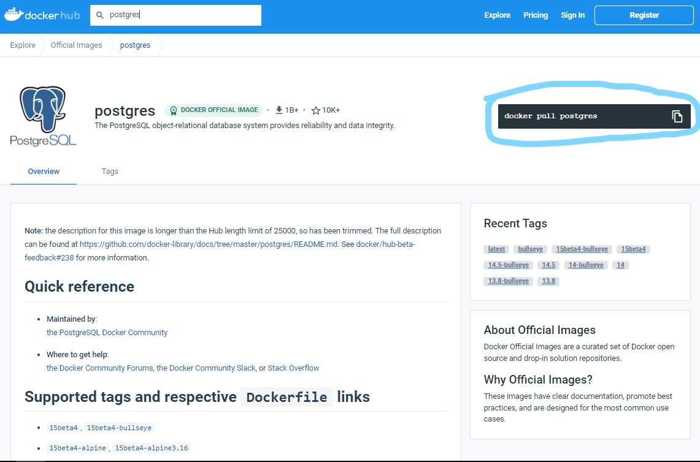
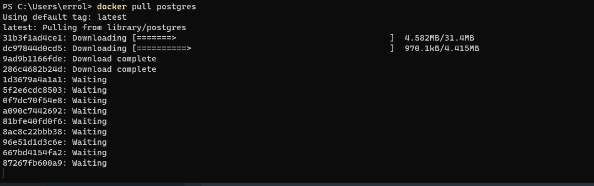

<h1>eleccion de imagen</h1>

Conociendo ya que es un archivo yaml procedemos a elegir una imagen disponible en [Docker-Hub][1.1] que sera la que utilizaremos para nuestra base de datos, esta la agregaremos posterior mente a un archivo de configuracion yaml de Docker-Compose en un servidor.

En esta oportunidad utilizaremos como imagen [postgres][1.2].

Donde se encuentra marcado es la instruccion para poder descargar la imagen en con ayuda de nuestro ejecutable.

[1.1]:https://hub.docker.com/
[1.2]:https://hub.docker.com/_/postgres